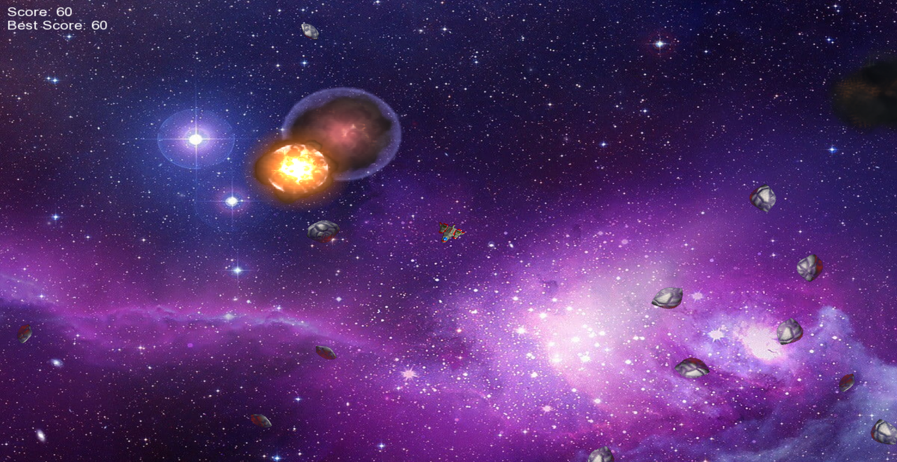
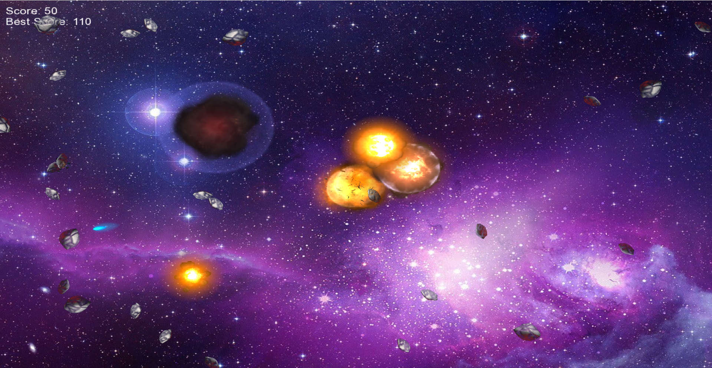
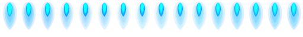

# Galactic Fury 🚀🚀

## Overview
Galactic Fury is an exciting space-themed game that combines fast-paced action with challenging gameplay. Navigate through a cosmic environment filled with asteroids, control a powerful spaceship, and engage in intense battles.

## Table of Contents
- [Getting Started](#getting-started)
  - [System Requirements](#system-requirements)
  - [Installation](#installation)
  - [Controls](#controls)
- [Gameplay](#gameplay)
  - [Objective](#objective)
  - [Entities](#entities)
  - [Scoring](#scoring)
- [Features](#features)
  - [Player Spaceship](#player-spaceship)
  - [Asteroids](#asteroids)
  - [Bullets](#bullets)
  - [Explosions](#explosions)
- [Tips and Strategies](#tips-and-strategies)
- [Known Issues](#known-issues)
- [Acknowledgments](#acknowledgments)

## Getting Started

### System Requirements
- Operating System: Windows, macOS, Linux
- Processor: 2.0 GHz dual-core
- Memory: 4 GB RAM
- Graphics: OpenGL 3.0+ compatible
- Storage: 100 MB available space

### Installation
1. Download the game from [[Here](https://github.com/Avinash7770/Galactic-Fury)].
2. Extract the files to your preferred location.
3. Run the executable file (e.g., GalacticFury.exe).

### Controls
- Arrow keys: Navigate spaceship
- Spacebar: Fire bullets
- Up Arrow: Activate thrust for the spaceship
- Right/Left Arrow: Rotate spaceship

## Gameplay

### Objective
Your mission is to survive the onslaught of asteroids and enemy spaceships. Destroy asteroids and avoid collisions to stay alive. Earn points by shooting down asteroids.

### Entities
- **Player Spaceship:** Controlled by the player, the spaceship is equipped with a blaster to shoot down asteroids.
- **Asteroids:** Floating obstacles that need to be destroyed to earn points.
- **Bullets:** Fired by the player's spaceship to destroy asteroids.
- **Explosions:** Occur when an asteroid is destroyed, providing visual feedback.

### Scoring

- Destroying an asteroid: +10 points
- Colliding with an asteroid: Reset to base score (0 points)

## Features

### Player Spaceship
- Responsive controls for navigation and rotation.
- Thrust activation for increased speed.
- Fire bullets to destroy asteroids.

### Asteroids
- Randomized movement patterns for challenging gameplay.
- Split into smaller asteroids upon destruction, adding complexity.

### Bullets
- Fired by the player's spaceship to eliminate asteroids.
- Limited range and lifetime.

### Explosions
- Visually appealing explosions upon asteroid destruction.
- Animations for player spaceship destruction.

  
  

## Tips and Strategies
- Stay Mobile: Constantly maneuver your spaceship to avoid collisions.
- Use Thrust Wisely: Activate thrust strategically to escape tight situations.
- Aim Precisely: Shoot bullets with precision to maximize your score.
- Watch Your Surroundings: Be aware of incoming asteroids from all directions.

## Known Issues
- **Asteroids Getting Stuck:**
   - Description: In rare cases, asteroids may get stuck at one place in the game environment.
   - Possible Causes: This issue might occur due to collision detection or movement calculations.
   - Resolution: Developers are actively investigating this issue, and a fix will be included in the next update. In the meantime, if you encounter a stuck asteroid, consider restarting the game session.

## Acknowledgments
Developed using the SFML (Simple and Fast Multimedia Library).
